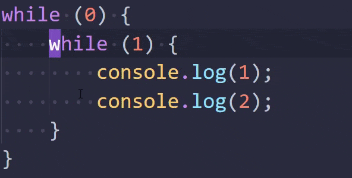
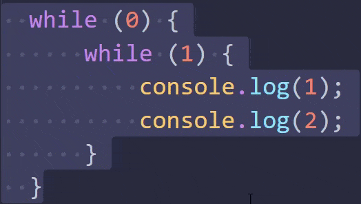

# Indent one space

## Features

You can move selected code left or right with the spacebar key.

## Settings
* **indentOneSpace.workOnSingleLine** (default `true`) - when `true` then even if 1 character on 1 line is selected command will work.
* **indentOneSpace.cramReversed** (default `true`)

**indentOneSpace.cramReversed: true**:

**indentOneSpace.cramReversed: false**

* **indentOneSpace.onlyCompleteRange** (default `false`)
 > indent works only when selection has nothing or whitespace characters on the sides

## Commands

* **Indent one space** default keybinding <kbd>Space</kbd>

* **Reverse indent one space** default keybinding <kbd>Shift</kbd>+<kbd>Space</kbd>

<!-- ## Known Issues -->

## Release Notes

[Changelog](CHANGELOG.md)

